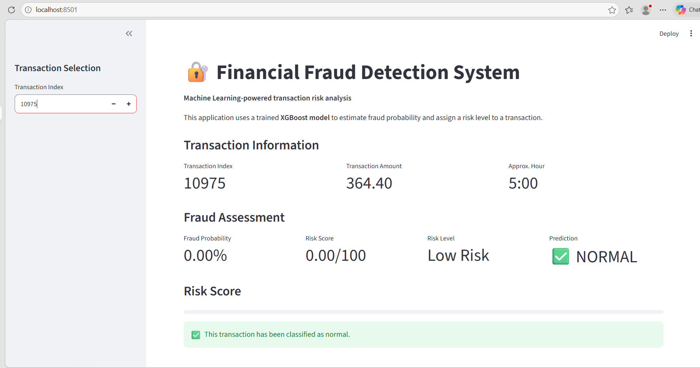
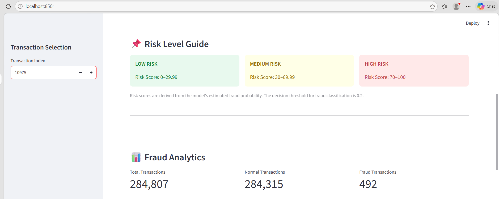
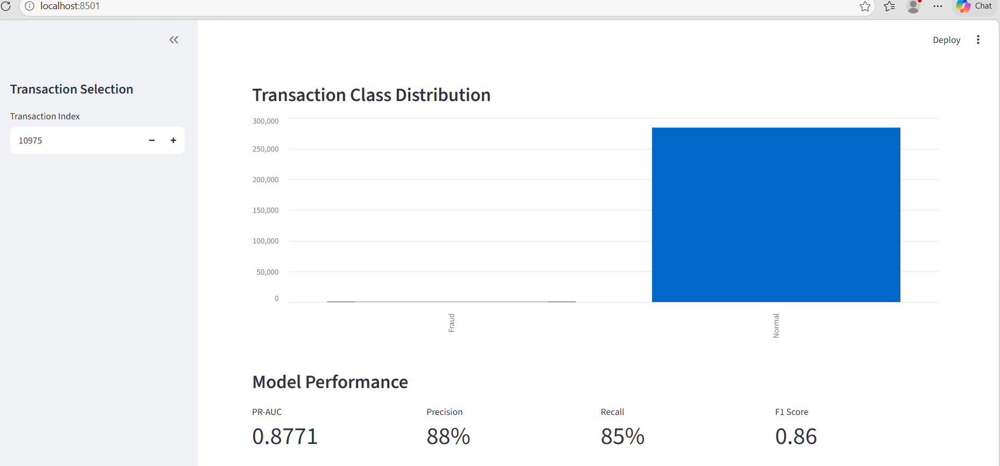

# 🔐 Financial Fraud Detection & Risk Prediction

A machine learning project that detects potentially fraudulent financial transactions and assigns a risk score using transaction-level features.

The project compares multiple machine learning approaches, handles severe class imbalance, optimizes the fraud decision threshold, and provides a Streamlit dashboard for interactive predictions.

---

## 📌 Project Overview

Financial fraud detection is a highly imbalanced classification problem because fraudulent transactions are much rarer than normal transactions.

This project builds an end-to-end fraud detection system that:

- Explores and analyzes transaction data
- Performs feature engineering
- Handles class imbalance using SMOTE experiments and class weighting
- Trains Logistic Regression, Random Forest, and XGBoost models
- Optimizes the classification threshold using validation data
- Evaluates the final model on an untouched test set
- Generates fraud probability and risk scores
- Provides an interactive Streamlit dashboard

---

## 📊 Dataset

The project uses the **Credit Card Fraud Detection** dataset.

Dataset characteristics:

- Total transactions: **284,807**
- Normal transactions: **284,315**
- Fraudulent transactions: **492**
- Fraud percentage: **0.1727%**

The dataset contains anonymized transaction features including `V1` to `V28`, along with transaction `Time`, `Amount`, and the target variable `Class`.

Where:

- `Class = 0` → Normal transaction
- `Class = 1` → Fraudulent transaction

---

## ⚙️ Feature Engineering

The project creates additional features from the original transaction information:

### Amount_Log

A logarithmic transformation of transaction amount:

```text
Amount_Log = log1p(Amount)---

## 🖥️ Dashboard Screenshots

### Main Dashboard



### Fraud Analytics



### Fraud Detection Example



### Additional Dashboard View


